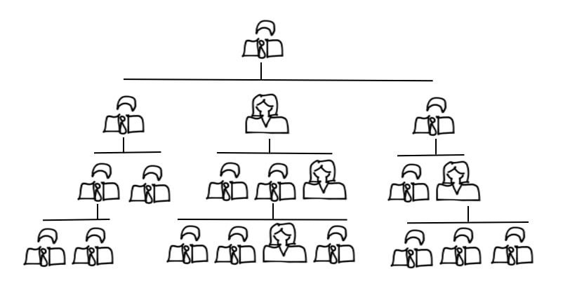
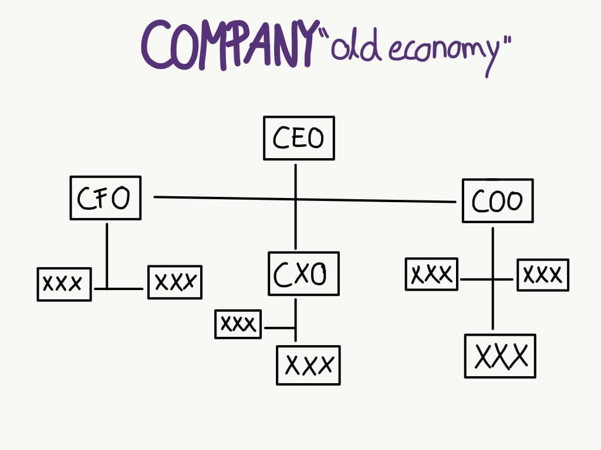
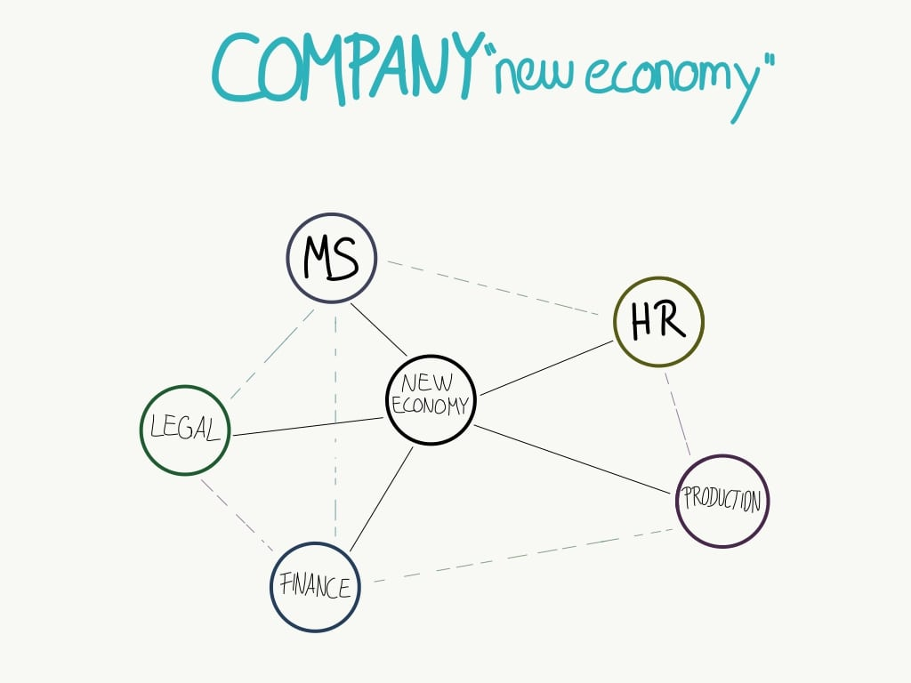
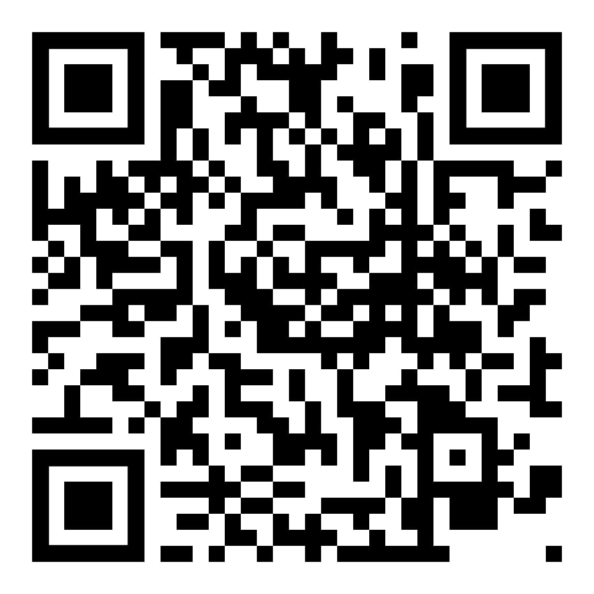

## Hierarchy

# mechanisms of power

---

## Agenda
1. Introduction
1. Hierarchy
1. Power
1. Connection between Power and Hierarchy
1. Case: Being a leader
1. Literature

---

## Introduction

**Leadership implies power**

* status and **power** are two important bases of **hierarchical differentiation**
* ...

---

## Hierarchy

---

## Hierarchy

_"the classification of a group of people according to ability or to economic, social, or professional standing"_

* word comes from the Greek hierarchēs
* word hierarchy is related to governmental words in English
* such as _monarchy, anarchy,_ and _oligarchy_

---

## Power

_noun_
* ability to act or produce an effect
* possession of control, authority, or influence over others

---

**possession of control, authority, or influence over others**

---

## Power

* related to one’s control over valued resources
* transforms individual psychology

---

## Connection between Power & Hierarchy

Studies observed hierarchies and power 

-> longer vertical line increases judged power

---

## Connection between Power & Hierarchy

-> the powerful think and act in ways that lead to the retention and acquisition of power
-> thereby increasing their power 

---

# WHY?

_people are preoccupied_
* phenomenon of social structure and social order
* hierarchy is a universal feature of social structure

---

**hierarchy‐enhancing belief systems**

stabilizing hierarchy
both from the bottom up and from the top down

---

# **What is a good leader in a digital organization?**

---

A digital organization is...

* agile
* fast
* disruptive
* adapative 
* technology driven

---

---

---

---

The people are...

* geneartion Z
* greedy for knowledge
* open minded
* flexible
* demanding (work-life-balance)
* decreasing importance of power distance
* diverse

---

The characteristics of a leader in the digital age are...

* integrity
* ability to delegate
* communication
* self-awareness
* gratitude
* learning agility
* empathy

---

**How to use the power of hierarchy in the right way?**

**Trust <**
**- > Purpose <**
**- > Culture <**
**- > Board Skills**

---

## ~~Power~~

---

# **Enable people to perform at their best**

---

# **GO ON GITHUB!**

---

## Literature
1. _8 Social Hierarchy: The Self‐Reinforcing Nature of Power and Status_, Joe C. Magee and Adam D. Galinsky
1. _Organizational Behavior and Human Decision Processes_, Volume 104, Issue 1, September 2007, Pages 30-44
1. _Rogers M.F. (1980) Goffman on Power, Hierarchy, and Status_. In: Ditton J. (eds) The View from Goffman. Palgrave Macmillan, London, Pages 100-101
1. https://www.merriam-webster.com/dictionary
1. 

---

## abc
**bold**
_italics_
* bullet

